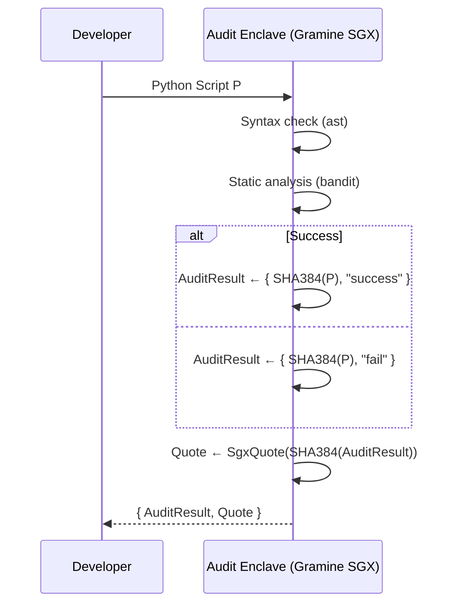
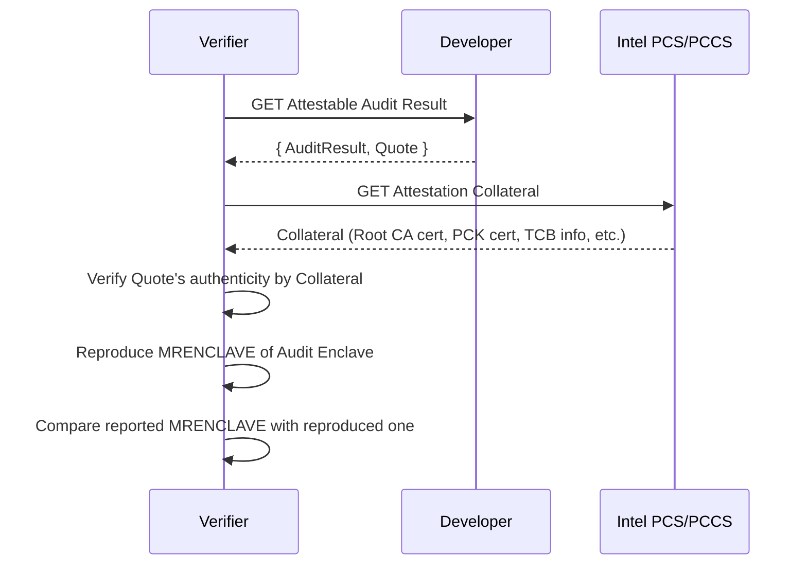

# Attestable Audit PoC

This repository is a proof of concept (PoC) that produces a *hardware-rooted* zero-knowledge proof (ZKP) of the result of auditing a program. The public values disclosed are `SHA-384(P)` of the audited program `P` and the audit outcome (`success` or `fail`); `P` itself never leaves the enclave. The proof is realised by running the audit inside a Trusted Execution Environment (TEE) and binding those two public values to a hardware-rooted attestation report — a verifier who trusts the published enclave measurement (`MRENCLAVE`) is thereby convinced that some `P` with the disclosed hash passed the audit, without learning `P`.

The enclave is built on [Gramine SGX](https://github.com/gramineproject/gramine), a library OS that runs an unmodified Python interpreter inside an Intel SGX enclave. Attestation follows the Intel DCAP flow; the test environment uses Azure THIM as the PCK certificate cache.

It utilises the following combination:

1. Audit target: Python scripts
2. Audit method: Syntax check by `ast` + security audit by [`bandit`](https://github.com/PyCQA/bandit)
3. Disclosed information: SHA-384 hash of the Python script and audit result (`success` or `fail`)

## Flow

### Attestable Auditing (this PoC)



### Audit Verification (out of scope)



As the audit logic is embedded in MRENCLAVE, an `AuditResult` with code hash `m` and result `"success"` serves as a ZKP for the following statement: "there exists a Python code `P` that satisfies `SHA384(P) = m` and passes the audit."

## Quick Start

### Test Environment

- **Cloud Service Provider**: Microsoft Azure
- **Region**: Japan East
- **Availability Zone**: Zone 3
- **Security type**: Trusted launch virtual machines (vTPM enabled)
- **Size Family**: DC1sv3
- **OS Image**: Ubuntu 24.04 LTS
- **Kernel**: 6.17.0-1013-azure
- **Gramine**: v1.9

### Setup

The enclave runs in the container, but DCAP quote generation goes through the host's AESM daemon. The following steps prepare the host once.

1. **Confirm SGX devices are present.**

   ```bash
   ls -l /dev/sgx_enclave /dev/sgx_provision
   ```

2. **Install AESM and the DCAP quote-generation stack.** The Gramine image does not ship a Quote Provider Library, so quote generation is delegated to AESM on the host.

   ```bash
   sudo apt-get update
   sudo apt-get install -y \
     sgx-aesm-service \
     libsgx-aesm-ecdsa-plugin \
     libsgx-aesm-launch-plugin \
     libsgx-dcap-ql \
     libsgx-dcap-default-qpl
   ```

3. **Point the Quote Provider Library at Azure THIM.** This repository ships [`sgx_default_qcnl.conf`](sgx_default_qcnl.conf), which fetches PCK certificates from the per-VM Azure IMDS THIM endpoint (`169.254.169.254`) and falls back to Intel PCS for verification collateral. Install it as the system config:

   ```bash
   sudo cp sgx_default_qcnl.conf /etc/sgx_default_qcnl.conf
   ```

4. **Enable and start AESM.**

   ```bash
   sudo systemctl enable --now aesmd
   ls -l /var/run/aesmd/aesm.socket    # should exist
   ```

   The container mounts `/var/run/aesmd` at runtime to reach this socket.

### Run

```bash
# Build Dockerimage
docker build -t attestable-audit-poc .

# Retrieve the reference MRENCLAVE baked into the image.
docker run --rm --entrypoint cat attestable-audit-poc /enclave/mrenclave.hex

# Generate AuditResult and SGX quote
mkdir -p ./output
docker run --rm \
  --device /dev/sgx_enclave \
  --device /dev/sgx_provision \
  -v /var/run/aesmd:/var/run/aesmd \
  -v "$PWD/samples:/work/samples:ro" \
  -v "$PWD/output:/work/output" \
  attestable-audit-poc \
  /work/samples/hello.py /work/output

# Display the AuditResult
cat output/audit_result.json

# Display the report data of the SGX quote
xxd -s 0x170 -l 64 output/quote.bin

# Display the reported MRENCLAVE in the SGX quote
xxd -s 0x70 -l 32 output/quote.bin
```

### Example output

```console
$ docker run --rm --entrypoint cat attestable-audit-poc /enclave/mrenclave.hex
1e959df7996b0d75f4ae93f59a007157882bd1944994c409f6baf78a3afe38db

$ docker run --rm ...

...
audit_result_sha384=4d7f5f0f06a916fc01e4178111e9a0f7419c92b63b3113b6cff3ac03fc078e416421916f7869ff4d917f3a0066d5a4e6
quote_size=4730
{"hashed":{"code":"1797358c48b127f4bb7cb69b9e04c3bc56d14eb70a59699ba2aaf7c7aa7db8af365ceb04d4b6d92a419bc92619ad3b81"},"raw":{"result":"success"}}
wrote: /work/output/audit_result.json
wrote: /work/output/quote.bin

$ cat output/audit_result.json
{"hashed":{"code":"1797358c48b127f4bb7cb69b9e04c3bc56d14eb70a59699ba2aaf7c7aa7db8af365ceb04d4b6d92a419bc92619ad3b81"},"raw":{"result":"success"}}a

$ xxd -s 0x170 -l 64 output/quote.bin
00000170: 4d7f 5f0f 06a9 16fc 01e4 1781 11e9 a0f7  M._.............
00000180: 419c 92b6 3b31 13b6 cff3 ac03 fc07 8e41  A...;1.........A
00000190: 6421 916f 7869 ff4d 917f 3a00 66d5 a4e6  d!.oxi.M..:.f...
000001a0: 0000 0000 0000 0000 0000 0000 0000 0000  ................

$ xxd -s 0x70 -l 32 output/quote.bin
00000070: 1e95 9df7 996b 0d75 f4ae 93f5 9a00 7157  .....k.u......qW
00000080: 882b d194 4994 c409 f6ba f78a 3afe 38db  .+..I.......:.8.
```
