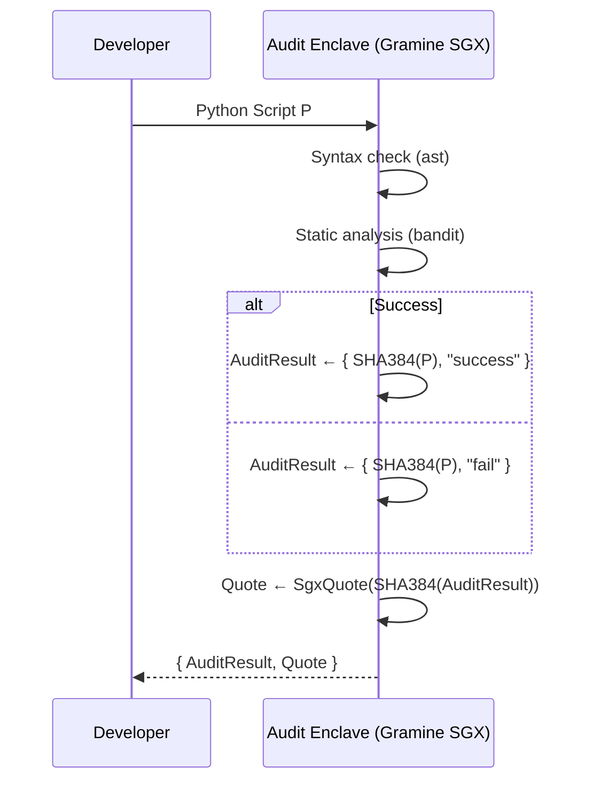
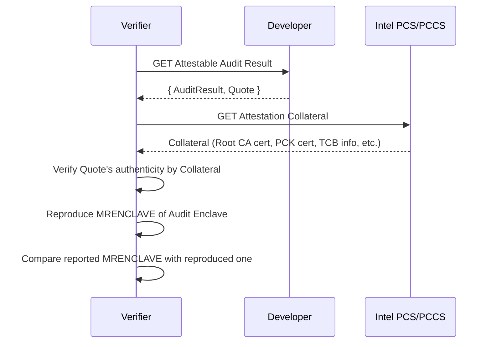

# Attestable Audit PoC

This repository is a proof of concept (PoC) that produces a *hardware-rooted* zero-knowledge proof (ZKP) of the result of auditing a program. The public values disclosed are `SHA-384(P)` of the audited program `P` and the audit outcome (`success` or `fail`); `P` itself never leaves the enclave. The proof is realised by running the audit inside a Trusted Execution Environment (TEE) and binding those two public values to a hardware-rooted attestation report — a verifier who trusts the published enclave measurement (e.g. `MRENCLAVE`) is thereby convinced that some `P` with the disclosed hash passed the audit, without knowing `P`.

The enclave is built on [Gramine](https://github.com/gramineproject/gramine), a library OS that runs an unmodified Python interpreter inside an Intel SGX enclave. Attestation follows the Intel DCAP flow; the test environment uses Azure THIM as the PCK certificate cache.

It utilises the following combination:

1. Audit target: Python scripts
2. Audit method: Syntax check by `ast` + security audit by [`bandit`](https://github.com/PyCQA/bandit)
3. Disclosed information: SHA-384 hash of the Python script and audit result (`success` or `fail`)

## Flow

### Attestable Auditing (this PoC)



### Audit Verification (out of scope)



As the audit logic is embedded in MRENCLAVE, an `AuditResult` with code hash `m` and result `"success"` serves as a ZKP for the following statement: "there exists a Python code `P` that satisfies `SHA384(P) = m` and passes the audit."

## Quick Start

### Test Environment

- **Cloud Service Provider**: Microsoft Azure
- **Region**: Japan East
- **Availability Zone**: Zone 3
- **Security type**: Trusted launch virtual machines (vTPM enabled)
- **Size Family**: DC1sv3
- **OS Image**: Ubuntu 24.04 LTS
- **Kernel**: 6.17.0-1013-azure
- **Gramine**: v1.9

### Setup

The enclave runs in the container, but DCAP quote generation goes through the host's AESM daemon. The following steps prepare the host once.

1. **Confirm SGX devices are present.**

   ```bash
   ls -l /dev/sgx_enclave /dev/sgx_provision
   ```

2. **Install AESM and the DCAP quote-generation stack.** The Gramine image does not ship a Quote Provider Library, so quote generation is delegated to AESM on the host.

   ```bash
   sudo apt-get update
   sudo apt-get install -y \
     sgx-aesm-service \
     libsgx-aesm-ecdsa-plugin \
     libsgx-aesm-launch-plugin \
     libsgx-dcap-ql \
     libsgx-dcap-default-qpl
   ```

3. **Point the Quote Provider Library at Azure THIM.** This repository ships [`sgx_default_qcnl.conf`](sgx_default_qcnl.conf), which fetches PCK certificates from the per-VM Azure IMDS THIM endpoint (`169.254.169.254`) and falls back to Intel PCS for verification collateral. Install it as the system config:

   ```bash
   sudo cp sgx_default_qcnl.conf /etc/sgx_default_qcnl.conf
   ```

4. **Enable and start AESM.**

   ```bash
   sudo systemctl enable --now aesmd
   ls -l /var/run/aesmd/aesm.socket    # should exist
   ```

   The container mounts `/var/run/aesmd` at runtime to reach this socket.

### Run

```bash
# Build Dockerimage
docker build -t attestable-audit-poc .

# Retrieve the reference MRENCLAVE baked into the image.
docker run --rm --entrypoint cat attestable-audit-poc /enclave/mrenclave.hex

# Generate AuditResult and SGX quote
mkdir -p ./output
docker run --rm \
  --device /dev/sgx_enclave \
  --device /dev/sgx_provision \
  -v /var/run/aesmd:/var/run/aesmd \
  -v "$PWD/samples:/work/samples:ro" \
  -v "$PWD/output:/work/output" \
  attestable-audit-poc \
  /work/samples/hello.py /work/output

# AuditResult
cat output/audit_result.json | jq

# MRENCLAVE in the SGX quote
xxd -s 0x70 -l 32 output/quote.bin

# Report data in the SGX quote
xxd -s 0x170 -l 64 output/quote.bin

# SHA-384 hash of the AuditResult
sha384sum output/audit_result.json

# SHA-384 hash of hello.py
sha384sum samples/hello.py
```

### Example output

```console
$ docker run --rm --entrypoint cat attestable-audit-poc /enclave/mrenclave.hex
75ea1a43f1ba346c858881a2a41874d49d881645cfc0485a85953f847e768919

$ cat output/audit_result.json | jq
{
  "code": {
    "data": "1797358c48b127f4bb7cb69b9e04c3bc56d14eb70a59699ba2aaf7c7aa7db8af365ceb04d4b6d92a419bc92619ad3b81",
    "hash": "SHA384"
  },
  "result": {
    "data": "success",
    "hash": "None"
  }
}

$ xxd -s 0x70 -l 32 output/quote.bin
00000070: 75ea 1a43 f1ba 346c 8588 81a2 a418 74d4  u..C..4l......t.
00000080: 9d88 1645 cfc0 485a 8595 3f84 7e76 8919  ...E..HZ..?.~v..

$ xxd -s 0x170 -l 64 output/quote.bin
00000170: eb70 9fe0 310a d1ab 87c2 2094 6304 d950  .p..1..... .c..P
00000180: 4358 8c4c d3e3 01ea 9868 8d23 9a84 8da9  CX.L.....h.#....
00000190: d95c 85cc 0bb0 4f66 ee94 4a9c 79e8 14ee  .\....Of..J.y...
000001a0: 0000 0000 0000 0000 0000 0000 0000 0000  ................

$ sha384sum output/audit_result.json
eb709fe0310ad1ab87c220946304d95043588c4cd3e301ea98688d239a848da9d95c85cc0bb04f66ee944a9c79e814ee  output/audit_result.json

$ sha384sum samples/hello.py
1797358c48b127f4bb7cb69b9e04c3bc56d14eb70a59699ba2aaf7c7aa7db8af365ceb04d4b6d92a419bc92619ad3b81  samples/hello.py
```
